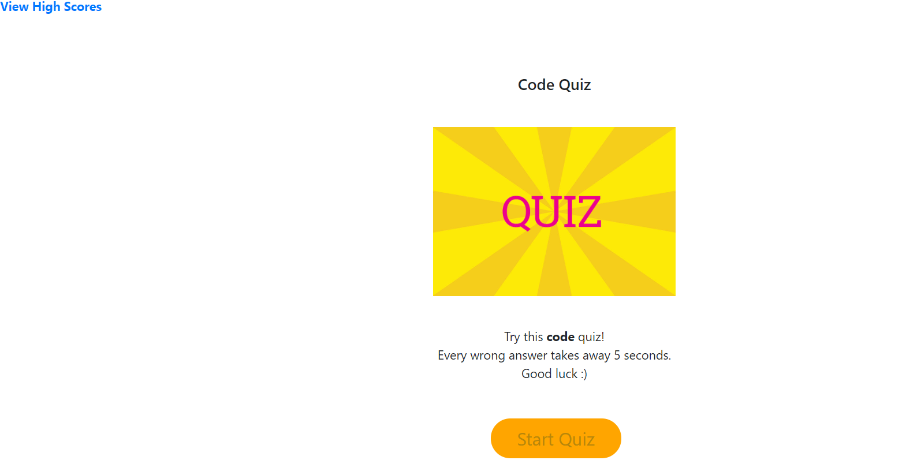
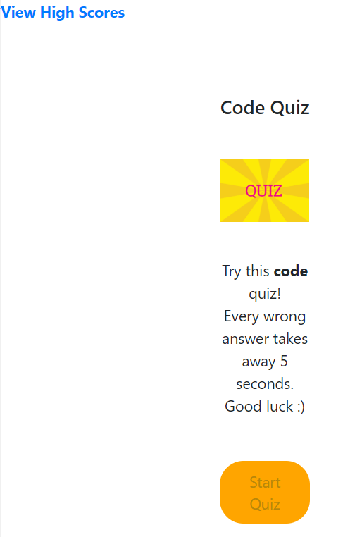

# Code-Quiz

https://khny258.github.io/Code-Quiz/

<strong>Desktop</strong>
 

<strong>Mobile</strong>
 

<strong>Create a code quiz where:</strong>

- Timer starts
- Answer mulitple choice questions
- Each wrong answer takes time away (5 seconds taken off for each wrong answer)
- When all of the questions are answered or time runs out, the quiz is over
- Logs the initials & high scores
